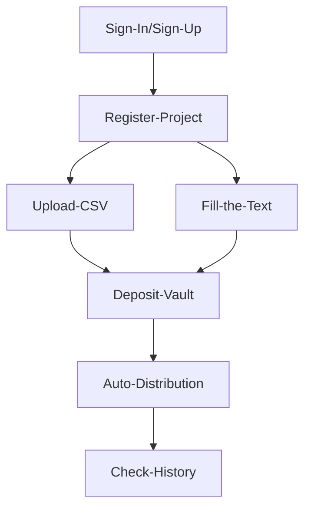

# AeroDump: Revolutionizing Token Distribution
`AeroDump` is a cutting-edge platform designed to simplify and automate the distribution of tokens for users and project owners across multiple blockchain networks. 
Built to support airdrops, marketing event rewards, and large-scale token transfers, AeroDump leverages the power of automation, cross-chain interoperability, and secure vaults to provide an efficient, hands-free solution for bulk token distribution.

### [AeroDump Platform](https://aerodump.vercel.app/)

# Process


## Key Features of this Flow:
**Easy Onboarding with Web3Auth:** 
- Web3Auth simplifies the login process by allowing users and project owners to use their social accounts for `secure and quick access` to the platform.
- This lowers the barrier for entry, especially for those unfamiliar with complex Web3 wallet setups.

**Hands-Free Automation with Multi-Network Support:**
- Chainlink Automation allows for `automatic triggering` of the token distribution from the LayerZero vault, while `Chainlink CCIP` ensures that tokens can be distributed across `multiple networks`. This enables cross-chain token distribution without the need for constant developer or operator intervention.

**Cross-Chain Flexibility:**
- With Chainlink CCIP, users or project owners can distribute tokens across various networks like `Ethereum, Solana, Avalanche`, and others. The tokens are `bridged seamlessly` to the chosen network during the distribution process.

**LayerZero Vault for Secure Holding:**
- The vault securely holds the tokens until the automation system triggers distribution. Tokens are only released when the conditions are met, ensuring safety and transparency.

**Scalability and Efficiency:**
- By leveraging both `Chainlink Automation` and `CCIP`, the system scales to handle bulk token transfers across various blockchains without the need for manual monitoring or intervention.

## User Journey


1. **Visit Platform and Log In**:
   - Log in easily using Web3Auth with your social accounts.

2. **Register Project and Tokens**:
   - Enter project details, token information, and more.

3. **Upload CSV File**:
   - Upload a CSV file containing recipient addresses, token amounts, and network details or Users paste the address, token amounts, and network details into text box directly.

4. **Deposit Tokens**:
   - Deposit the tokens into the LayerZero vault for distribution.

5. **Automated Token Distribution**:
   - Chainlink Automation distributes tokens to recipients based on the CSV file, with multi-chain support via Chainlink CCIP.

6. **Check Distribution History**:
   - After completion, view all records on the history page using ENVIO on-chain indexing.

## Foundry

**Foundry is a blazing fast, portable and modular toolkit for Ethereum application development written in Rust.**

Foundry consists of:

-   **Forge**: Ethereum testing framework (like Truffle, Hardhat and DappTools).
-   **Cast**: Swiss army knife for interacting with EVM smart contracts, sending transactions and getting chain data.
-   **Anvil**: Local Ethereum node, akin to Ganache, Hardhat Network.
-   **Chisel**: Fast, utilitarian, and verbose solidity REPL.

## Documentation

https://book.getfoundry.sh/

## Usage

### Build

```shell
$ forge build
